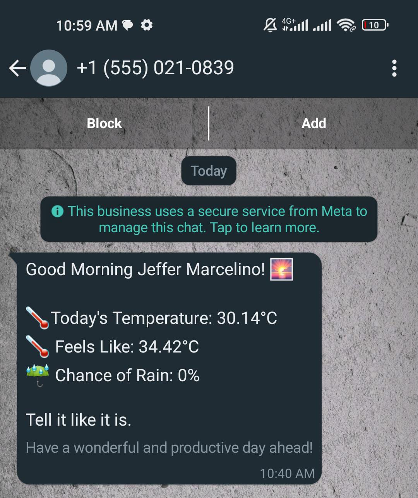

# WhatsApp Daily Updates Bot

## Overview
WhatsApp Daily Updates Bot is a simple bot that sends daily weather information and advice, to your WhatsApp account.

## Example
</img>

## Getting Started

### Prerequisites

Before you begin, make sure you have the following:

- [Node.js](https://nodejs.org/) installed on your machine
- [WhatsApp Business API](https://developers.facebook.com/docs/whatsapp/cloud-api/overview) account with a valid token
- [OpenWeatherMap API](https://openweathermap.org/) key
- Create a template message called ```good_morning``` on [WhatsApp Business API](https://developers.facebook.com/docs/whatsapp/cloud-api/overview)


### Template Message

Create a template message on WhatsApp called good_morning with the following content:

```
Good Morning {{1}}! 🌅

🌡Today's Temperature: {{2}}°C
🌡 Feels Like: {{3}}°C
☔ Chance of Rain: {{4}}% 

{{5}}
```

### Installation

1. Fork the repository [clicking here](https://github.com/JefferMarcelino/whatsapp-daily-updates-bot/fork)
2. Clone the repository:
  ```bash
  git clone https://github.com/your-username/whatsapp-daily-updates-bot.git
  ```

3. Navigate to the project directory:
  ```bash
  cd whatsapp-daily-updates-bot
  ```

4. Install dependencies:
  ```bash
  npm install
  ```

5. Create a `.env` file in the project root and add your credentials:
  ```javascript
  WEATHER_API=xxxxxxxxxxxxxxxxxxxxxxxx // your weather api key
  LAT=xxxxxx  // your latitude
  LON=xxxxxx // your longitude
  WA_TOKEN=xxxxxxxxxxxxxxxxxxxxx // your Whatsapp token
  WA_ID=xxxxxxxxxxxxxx // your whatsapp number id
  OWNER_NAME="Jeffer Marcelino" // your name
  OWNER_NUMBER="xxxxxxxx" // your whatsapp number that will receive the messages (includin the ddd, for example for mozambique 25884xxxxxxx)
  ```


### Usage

#### Running Locally

To run the bot locally, ensure you have the `.env` file with valid credentials and execute:

```bash
npm start
```

#### Running on GitHub Actions
1. Fork the repository.
2. Set up the necessary [GitHub Secrets](https://docs.github.com/en/actions/security-guides/using-secrets-in-github-actions) in your repository settings using the credentials from the .env file.

## Contributing
Contributions are welcome! If you have suggestions, feature requests, or find a bug, please open an issue or submit a pull request.